# cGAN_MNIST
Generation of MNIST like digits using [Conditional Generative Adversarial Nets](https://arxiv.org/pdf/1411.1784.pdf).

## About

This is implementation of the paper, "[Conditional Generative Adversarial Nets](https://arxiv.org/pdf/1411.1784.pdf)" by Mehdi Mirza, Simon Osindero.

This code is implemented using [Keras](https://keras.io/) and [Tensorflow](https://www.tensorflow.org/) frameworks.

## Files

- [`cgan_mnist.py`](cgan_mnist.py) : This is the code for python implementation of [Conditional Generative Adversarial Nets](https://arxiv.org/pdf/1411.1784.pdf)
- [`plots`](plots) : Loss plots for different number of total epochs
- [`images_generated`](images_generated) : Generated MNIST like digits at every sample interval (200) when training the model for 20000 epochs
- [`images_generated_5000epochs`](images_generated_5000epochs) : Generated MNIST like digits at every sample interval (50) when training the model for 5000 epochs

## Usage

Clone the repository, change your present working directory to the cloned directory, Now create a now folder in this directory named `generated` to save the generated digits after every sampled interval and now train the model. Below comands accomplishes these steps.

```
$ git clone https://github.com/manideep2510/cGAN_mnist.git
$ cd cGAN_mnist
$ mkdir generated
$ python cgan_mnist.py
```

## Let's understand what are Conditional GANs!

### Firstly, what are Generative Adversarial Networks?

<p align="center">
    
</p>

[Generative Adversarial Networks](https://arxiv.org/abs/1406.2661) or in short GANs are a type of generative models which can generate data which resembles the training data by learning the probability distribution of the training data through two-player minimax game between two networks namely Generator and Discriminator.

Generator try to learn the probability distribution of the training data and generate outputs which resemble the training data. Discriminator on the other hand, takes the generated output from the generator and it predict whether the generated output is from the training data or not. 

The discriminator will try to tell that the generated outputs are not from trainng data distribution and the generator will try to fool the discriminator by generating nearly realistic outputs close to input data distribution.

The [meaning](https://dictionary.cambridge.org/dictionary/english/adversarial) of the term adveserial means "opposing or disagreeing with each other"

Here the generator and discriminator are disagreeing with each other as generator is trying to fool the discriminator and the discriminator trying to discriminate the generator.

The generator tries to generate outputs similar to training data so the generator tries to decrease it's cost but the discriminator will try to tell that the generated data is not from the input distribution, hence the discriminator tries to increase it's cost. This is why the generator and discriminator are said to be in a *two-player minimax game*.

The loss function of Generative Adversarial Networks looks like this,

<p align="center">
    
</p>

Here the input of generator is `m` dimensional gaussian noise and the output is a `n` dimensional vector which is close to the input probability distribution.

### Now the Conditional Generative Adversarial Networks... 

[Conditional Generative Adversarial Nets](https://arxiv.org/pdf/1411.1784.pdf) are the conditional version of generative adversarial nets, which can be constructed by simply feeding the data, `y`, we wish to condition on to both the generator and discriminator. 

Generative adversarial nets can be extended to a conditional model if both the generator and discriminator are conditioned on some extra information `y`. `y` could be any kind of auxiliary information, such as class labels or data from other modalities

We can perform the conditioning by feeding `y` into the both the discriminator and generator as additional input layer.

<p align="center">
    
</p>

In the generator the prior input noise `Pz(z)`, and `y` are combined in joint hidden representation, and the adversarial training framework allows for considerable flexibility in how this hidden representation is composed. 

In the discriminator x and y are presented as inputs and to a discriminative function.

The objective function of a two-player minimax game in the conditional case would be,

<p align="center">
    
</p>

As you can see, the difference between the cost functions of a simple GANs and Conditional GANs is that in Conditional GANs `x` and `z` are conditioned on `y`.

## Results

The plot for losses of generator and discriminator for 5000 epochs is below.

<p align="center">
    
</p>

As you can see the losses are not stable and oscillate very much. On a high level, the simple reason is "it is easy to identify a painting than to draw one".

Here are the generated digits after every every 1000 epochs,

<p float="left">
  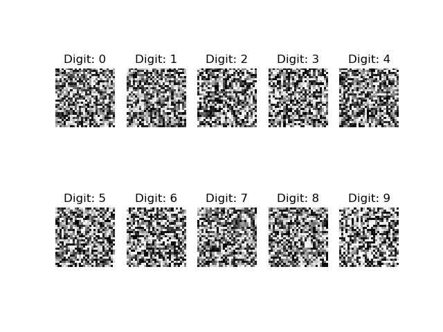
  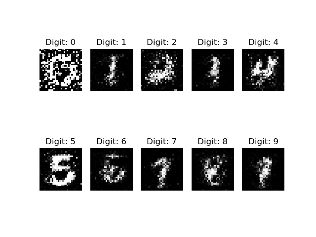 
  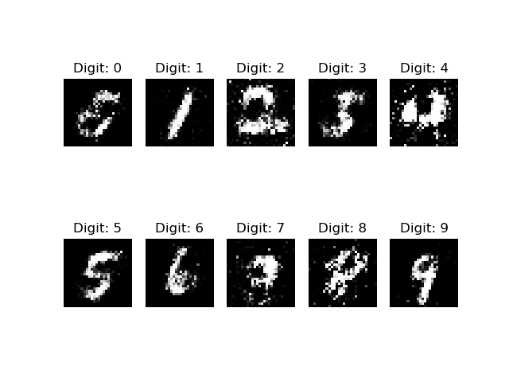
  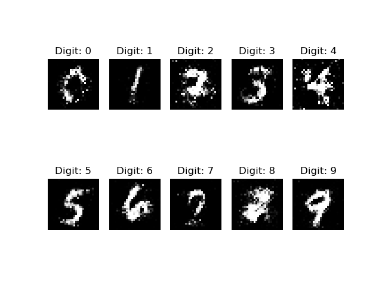
  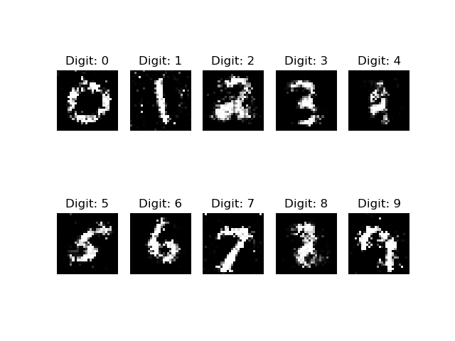
  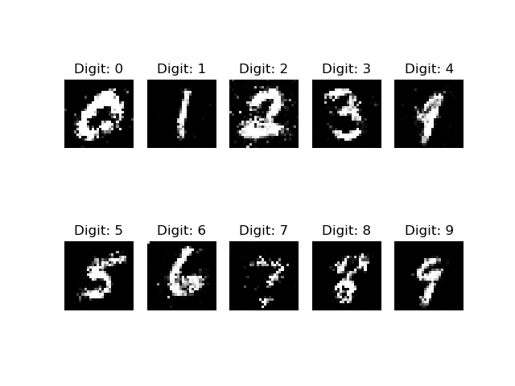
  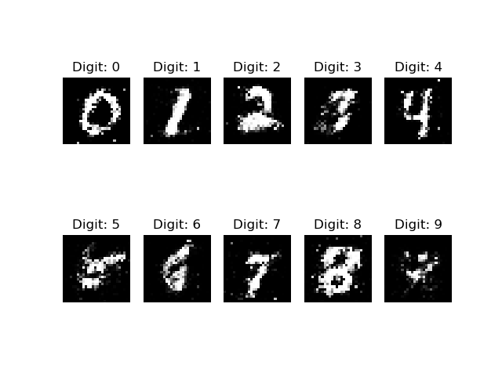 
  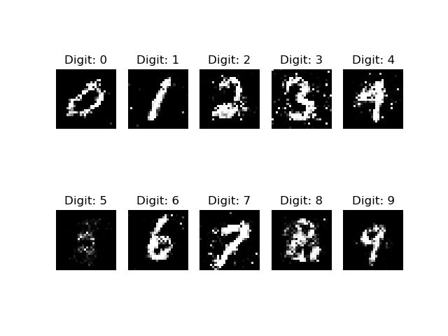
  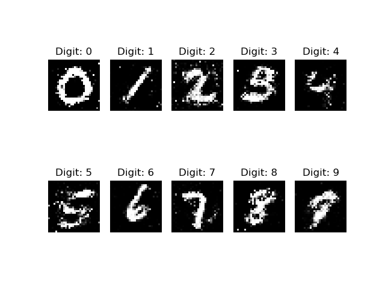
  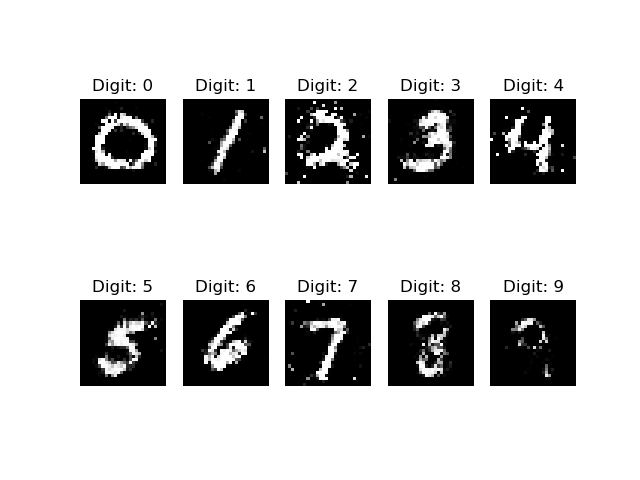
  
  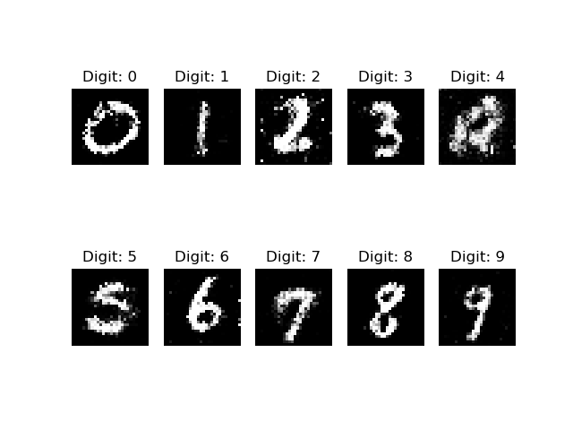 
  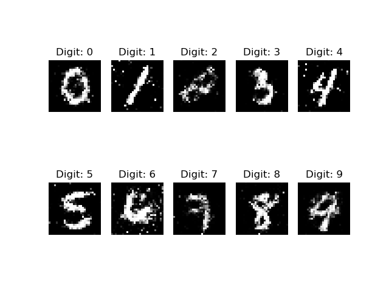
  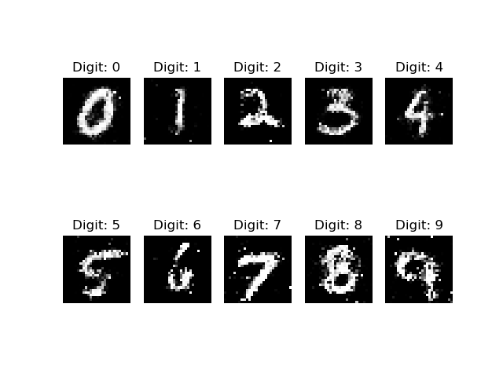
  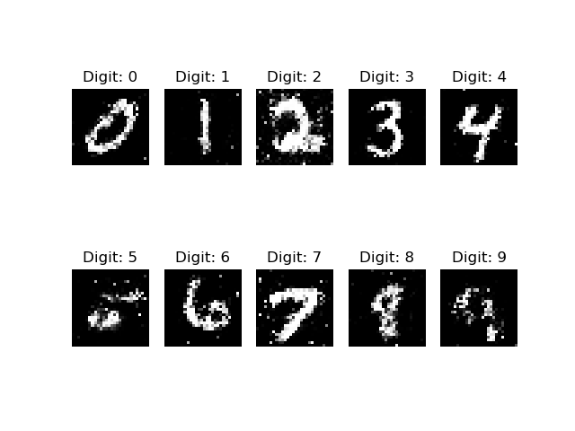
  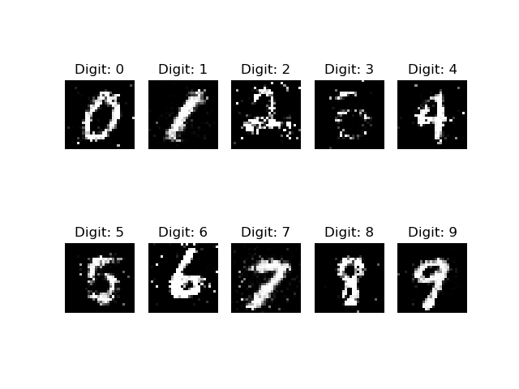
  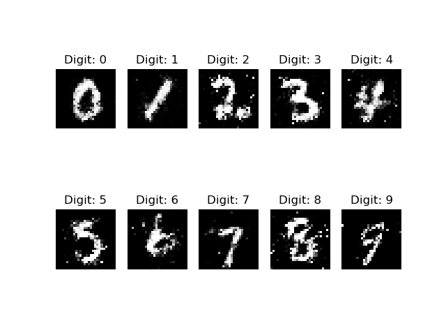 
  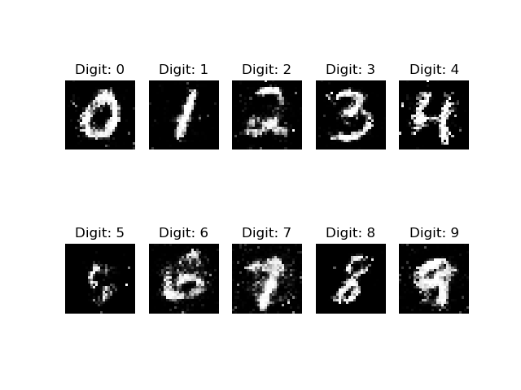
</p>

## References

- [Conditional Generative Adversarial Nets](https://arxiv.org/pdf/1411.1784.pdf), Mehdi Mirza, Simon Osindero
- [Generative Adversarial Networks](https://arxiv.org/abs/1406.2661), Ian J. Goodfellow, Jean Pouget-Abadie, Mehdi Mirza, Bing Xu, David Warde-Farley, Sherjil Ozair, Aaron Courville, Yoshua Bengio
- [Keras: The Python Deep Learning library](https://keras.io/)
- [Tensorflow: An open source machine learning framework for everyone](https://www.tensorflow.org/)
